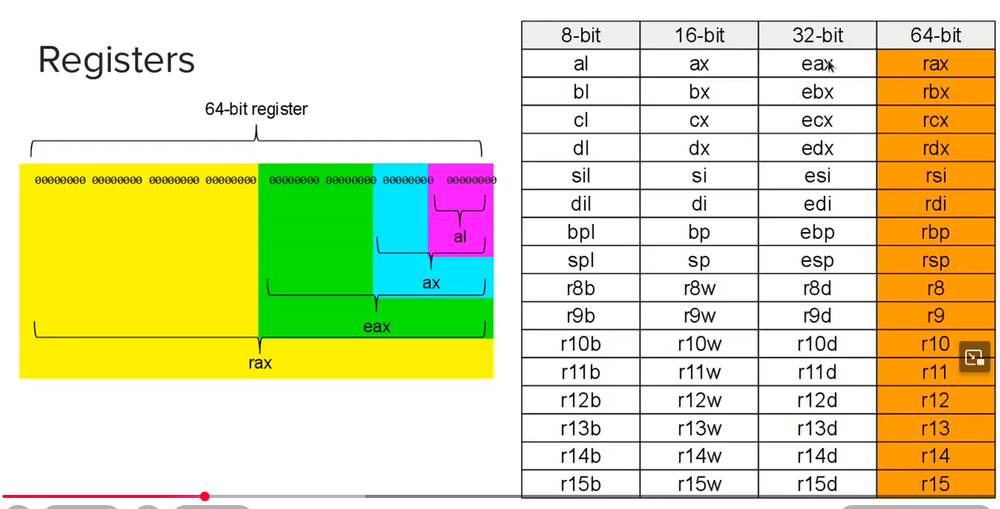
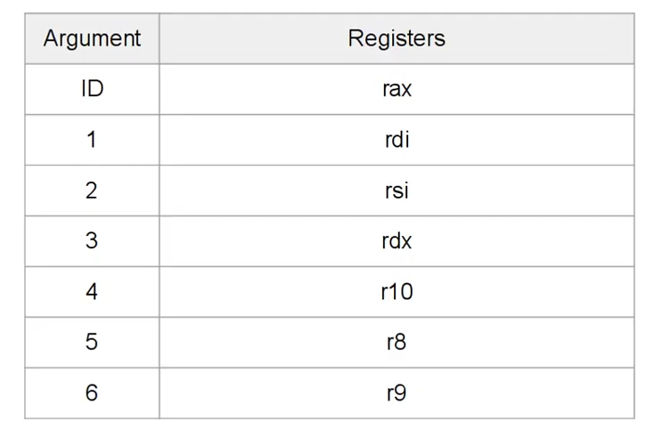

# x86-64 ASM notes

```s
text db "Hello, World!",10
```

this is a name assigned to the address in memory that this data is located in

```s
text
```

define bytes

```s
db
```

the below is the bytes of data we are defining. The 10 is a newline character `\n`

```s
"Hello, World!",10
```

## available registers



[source](https://youtu.be/BWRR3Hecjao?si=jU0myc7HmExQ24Xj)

### Loop and movsb

loop is one of the few "legacy" instructions in x86_64 that is hard-wired to a specific register.

```s
mov rcx, 1000
some_label:
  ; do some stuff
  loop some_label
```

Think of it like this:

- rax is the "Return" register (for syscall results).
- rdi/rsi are the "Argument" registers (for syscall inputs).
- rcx is the "Counting" register.

The CPU designers made loop, rep movsb, and rep stosb all rely on rcx

The rep (Repeat) prefix is the sibling of loop. It tells the CPU: "Keep moving bytes from rsi to rdi until rcx hits zero.

this moves bytes from rsi to rdi until rcx hits zero.

```s
mov rcx, 16
rep movsb   
```

## syscalls

Following the System V ABI, which is required on Linux and other Unices for system calls,
invoking a system call requires us to put the system call code in the register rax,
the parameters to the syscall (up to 6) in the registers rdi, rsi, rdx, rcx, r8, r9, and additional parameters,
if any, on the stack (which will not happen in this program so we can forget about it).
We then use the instruction syscall and check rax for the return value, 0 usually meaning: no error.

[source](https://gaultier.github.io/blog/x11_x64.html)



[source](https://youtu.be/BWRR3Hecjao?si=jU0myc7HmExQ24Xj)

[a good searchable table that leads back to the documentation](https://filippo.io/linux-syscall-table/)

### Looking up opcodes for arguments

Low and behold it's all on your system. in the below example we lookup opcodes for a unix socket

```bash
grep -R "PF_LOCAL" /usr/include/bits/socket.h
```

the output

```txt
#define PF_LOCAL        1       /* Local to host (pipes and file-domain).  */
#define PF_UNIX         PF_LOCAL /* POSIX name for PF_LOCAL.  */
#define PF_FILE         PF_LOCAL /* Another non-standard name for PF_LOCAL.  */
#define AF_LOCAL        PF_LOCAL
```

## Instructions and Other Documentation

[https://web.stanford.edu/class/cs107/guide/x86-64.html](https://web.stanford.edu/class/cs107/guide/x86-64.html)
