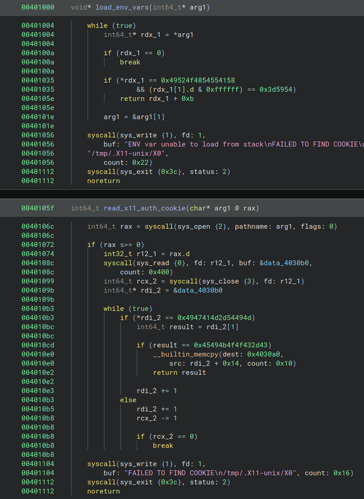
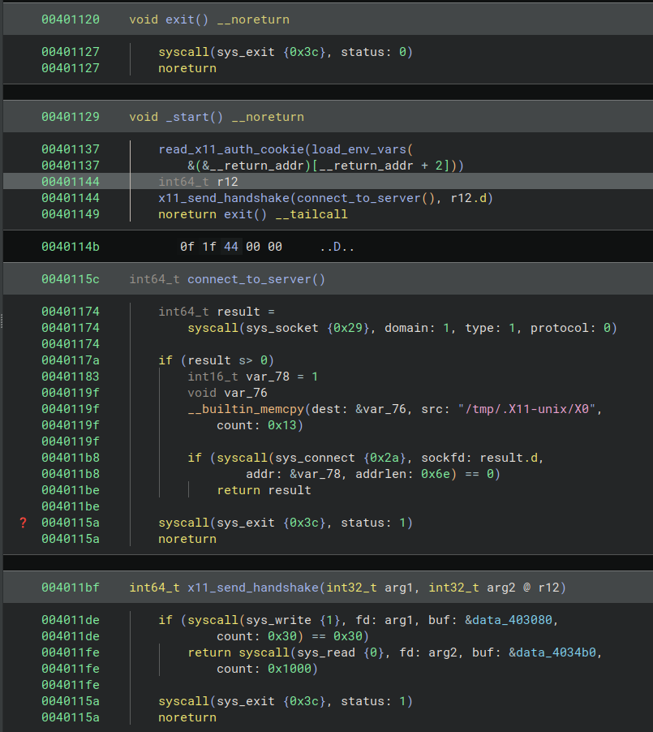
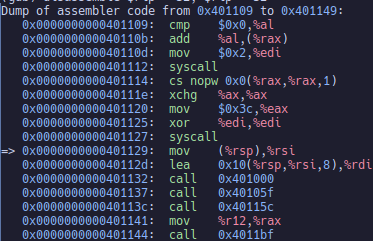

# Analysis Of The Program Window

## Strings Outputs

### Debug

here we spotted a lot of the symbol names we defined


here we spotted the x11 socket's path, so we can tell that this program is going to open a socket and authenticate with x11. Since the [socket](https://man7.org/linux/man-pages/man2/socket.2.html) syscall just opens an endpoint for communication this could possibly reveal information about any network communication that's going on in the program


### Release

the release output was far more simple as the release build strips the symbols out of the program. This would be what you'd want to distribute as it would lack system specific, and crucial symbols from the code.


## Running BinNinja on the release build

I was able to identify my functions and rename the c generated by binaryninja to better reflect the contents of the program.





## Running the release build in gdb

I was able to run the program in gdb and disassemble it and read the assembly instructions. 

```gdb
info file 
```

will give you the starting point

then you can

```gdb
break *<hex_address_of_starting_point>
```

and

```gdb
run
```

now it should stop at the entry point and you can use `si` to step instructions

or you can use the `disassemble` command to get the assembly code

```gdb
disassemble $rip - 32, $rip + 32
```


