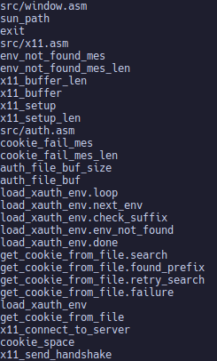
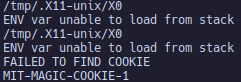
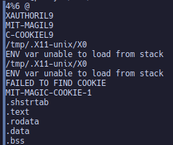

# Analysis Of The Program Window

## Strings Outputs

### Debug

here we spotted a lot of the symbol names we defined

here we spotted the x11 socket's path, so we can tell that this program is going to open a socket and authenticate with x11. Since the [socket](https://man7.org/linux/man-pages/man2/socket.2.html) syscall just opens an endpoint for communication this could possibly reveal information about any network communication that's going on in the program

### Release

the release output was far more simple as the release build strips the symbols out of the program. This would be what you'd want to distribute as it would lack system specific, and crucial symbols from the code.

